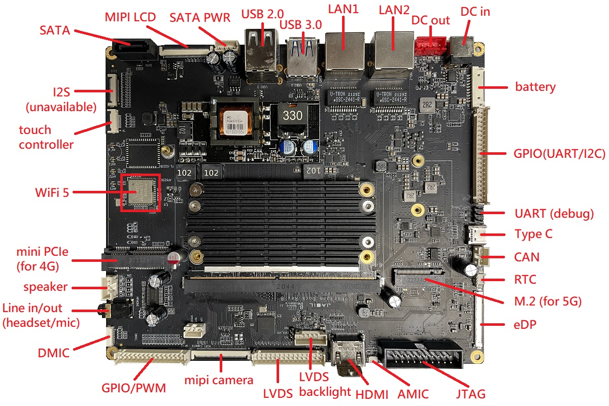
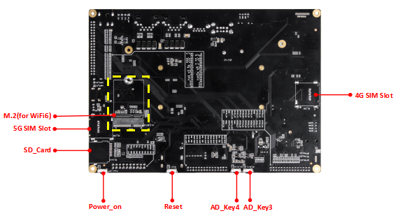
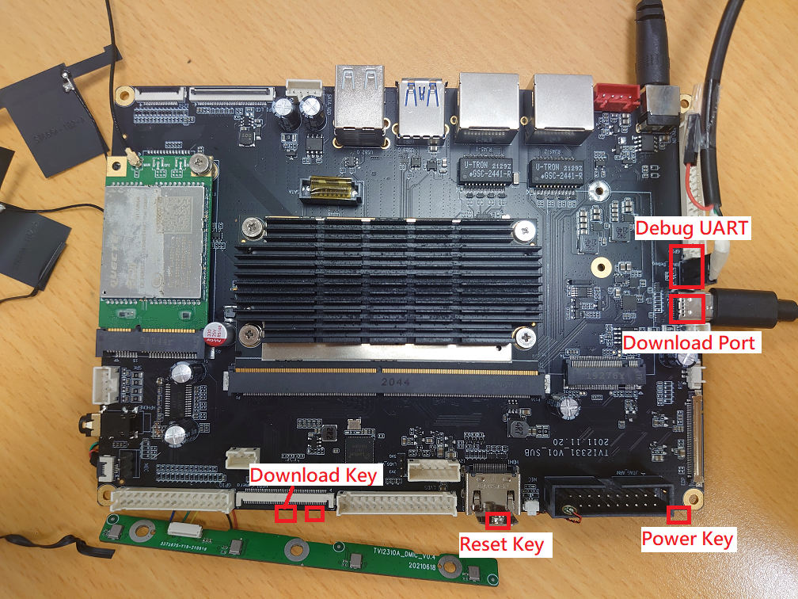
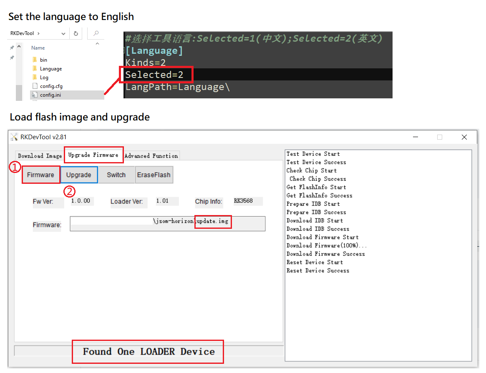
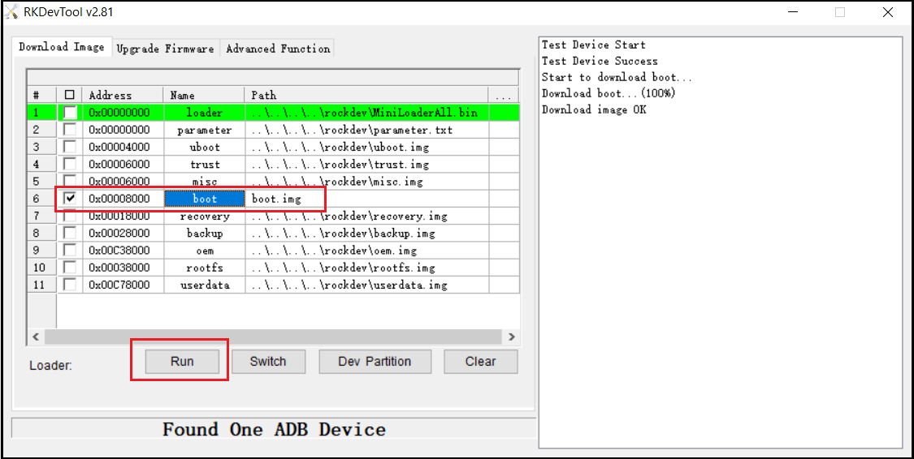

# JSOM HORIZON

+ Horizon-Core-Single
+ Horiozn-Core-Dual

--------------------------------------------------------------------------------
# Dock layout

## Horizon Dock layout (Front)



## Horizon Dock Layout (Back)



--------------------------------------------------------------------------------
# Compilation

+ Recommended host platform: Ubuntu 18.04
    + Need fixes on Ubuntu 16.04

## Setup Build Environment

```bash
$ sudo apt-get install \
    repo git ssh make gcc libssl-dev liblz4-tool expect g++ patchelf chrpath \
    gawk texinfo chrpath diffstat binfmt-support qemu-user-static live-build \
    bison flex fakeroot cmake gcc-multilib g++-multilib unzip \
    device-tree-compiler python-pip ncurses-dev pyelftools

# support of GIT LFS
$ sudo apt-get install software-properties-common
$ curl -s https://packagecloud.io/install/repositories/github/git-lfs/script.deb.sh | sudo bash
$ sudo apt-get install git-lfs
# run the following per user account
$ git lfs install

$ sudo locale-gen en_US.UTF-8
```

## Fetch Source Code

```bash
# Install Google repo tool
$ curl https://storage.googleapis.com/git-repo-downloads/repo > ~/bin/repo
$ chmod a+x ~/bin/repo

# alternativel, download from Jabil Github
$ git clone git@github.com:jabil-taipei/repo
$ mkdir -p ~/bin; mv repo ~/bin/
$ chmod a+x ~/bin/repo

# Create a new project folder named proj or any other you prefer
$ mkdir proj; cd proj

# Download source code from Github
#   use either horizon-core-single.xml or horizon-core-dual.xml
# setup repo info(add '--depth=1' to speed up the download process by fetching only the last commits)
$ repo init \
    --repo-url=git@github.com:jabil-taipei/repo \
    --no-repo-verify \
    -u git@github.com:jabil-taipei/manifests \
    -b jsom-horizon \
    -m horizon-core-single.xml

# download source repo
$ repo sync -c --force-sync

# checkout source code(will override your modifications)
$ repo sync -l
```

## Fixes on Ubuntu 16.04

+ replace `PROJ_DIR/yocto/poky/meta/recipes-devtools/rpm` with  `inc/patch/yocto/poky/meta/recipes-devtools/rpm`

```bash
# Install GCC 8 on Ubuntu 16.04
$ sudo add-apt-repository ppa:ubuntu-toolchain-r/test
$ sudo apt-get update
$ sudo apt-get install gcc-8 g++-8
$ gcc-8 --version
```

## Build Images

+ artifacts: proj/rockdev
    + update.img: full flash image
    + boot.img
    + MiniLoaderAll.bin
    + misc.img
    + oem.img
    + recovery.img
    + rootfs.ext4
    + rootfs.img: a soft link to yocto/build/lastest/rootfs.img
    + uboot.img
    + userdata.img


```bash
# Execute the following before building or add them to your .bashrc
$ export LANG=en_US.UTF-8 LANGUAGE=en_US.en LC_ALL=en_US.UTF-8
$ export RK_ROOTFS_SYSTEM=yocto

# BoardConfig-Horiozn-Core-Dual.mk
# BoardConfig-Horizon-Core-Single-HDMI.mk
# BoardConfig-Horizon-Core-Single-MIPI.mk
$ ./build.sh lunch

# Build all necessary images
$ ./build.sh all

# Generate flash image
$ sudo ./mkfirmware.sh device/rockchip/.BoardConfig.mk
$ ./build.sh updateimg

# Optional: Build separate components; run './build.sh -h' for the details
$ ./build.sh uboot
$ ./build.sh kernel
$ ./build.sh yocto
...
```

## Problems

>     LZ4     arch/arm64/boot/Image.lz4
>   Incorrect parameters
>   Usage :
>         lz4 [arg] [input] [output]

lz4 version is too old

```bash
$ git clone https://github.com/lz4/lz4.git
$ make
# backup the current lz4
$ sudo cp /usr/bin/lz4 /usr/bin/lz4.bak
# expected to install in /usr/local/bin and preceeds /usr/bin/lz4
$ sudo make install
```

--------------------------------------------------------------------------------
# Flash Programming



## Windows

1. Install USB driver [DriverAssitant_v5.0.zip](./inc/utils/DriverAssitant_v5.0.zip)
2. Extract [RKDevTool.zip](./inc/utils/RKDevTool.zip) and run `RKDevTool.exe`
    + load image
    + hold download key and press reset key to enter download mode
    + start programming



## Update Kernel Partition



--------------------------------------------------------------------------------
# Others

## Check Jabil Demo Image Version

```bash
$ hexdump -C -n 16 -s 33554416 /dev/disk/by-partlabel/boot|cut -c 62-77
s-mipi    010000
```
